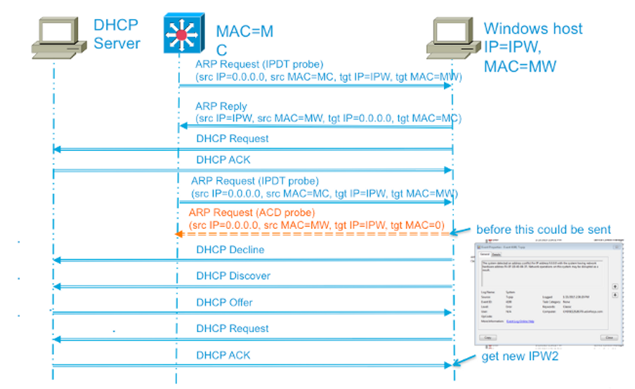

# Dupplicate Address Detect

This tool has been designed to facilitate the prompt identification of any instance where multiple devices may be using the same IPv4 address on a given subnet. When two or more devices share the same IPv4 address, the routing of packets can be impacted and may not function correctly. It is important to note that duplicate IP addresses can arise from a "rogue" or unauthorized DHCP server operating within a subnet or from the assignment of a static IP address within the typical IP assignment range of a DHCP server.

